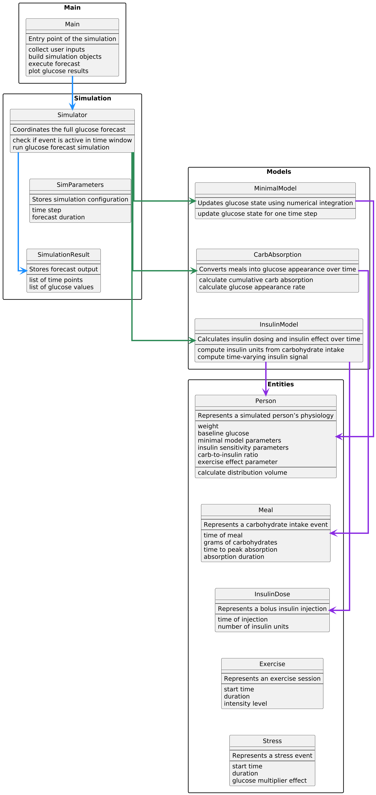

# Architecture Overview

## Main Components

- **Main**  
  Entry point of the program. Collects user input, builds simulation objects, runs the forecast, and plots glucose results.
- **Simulator**  
  Coordinates the full glucose forecast. Determines which inputs are active at each time step and calls the appropriate models.
- **SimulationResult**  
  Stores the output of the simulation, including time points and corresponding glucose values.
- **SimParameters**  
  Stores configuration values such as the time step and forecast duration.
- **MinimalModel**  
  Updates the glucose state for each time step using numerical integration.
- **CarbAbsorption**  
  Converts meal information into glucose appearance over time.
- **InsulinModel**  
  Computes insulin dosing and models the insulin effect over time.
- **Person**  
  Represents the simulated individual’s physiology, including weight, baseline glucose, model parameters, insulin sensitivity, carb-to-insulin ratio, and exercise effect parameter.
- **Meal**  
  Represents food intake, including time eaten, carbohydrate amount, time-to-peak absorption, and absorption duration.
- **InsulinDose**  
  Represents insulin taken, including time and number of units.
- **Exercise**  
  Represents physical activity with start time, duration, and intensity.
- **Stress**  
  Represents stress exposure with start time, duration, and glucose multiplier effect.

## Mapping to UML Design
- 

## Architectural Changes

- Split the original glucose logic into focused model components for better organization.
  - Added/Updated:
    - minimal_model.py
    - carb_absorption.py
    - insulin_model.py

- Expanded the Person class to include full physiological parameters used in calculations.
  - Updated:
    - person.py

- Introduced a dedicated simulation layer to manage timing and execution.
  - Added:
    - simulator.py
    - parameters.py

- Reorganized the project into a clear folder structure:

  - **entities/**
    - person.py
    - meal.py
    - insulin.py
    - exercise.py
    - stress.py

  - **models/**
    - minimal_model.py
    - carb_absorption.py
    - insulin_model.py

  - **simulation/**
    - simulator.py
    - parameters.py

  - main.py
